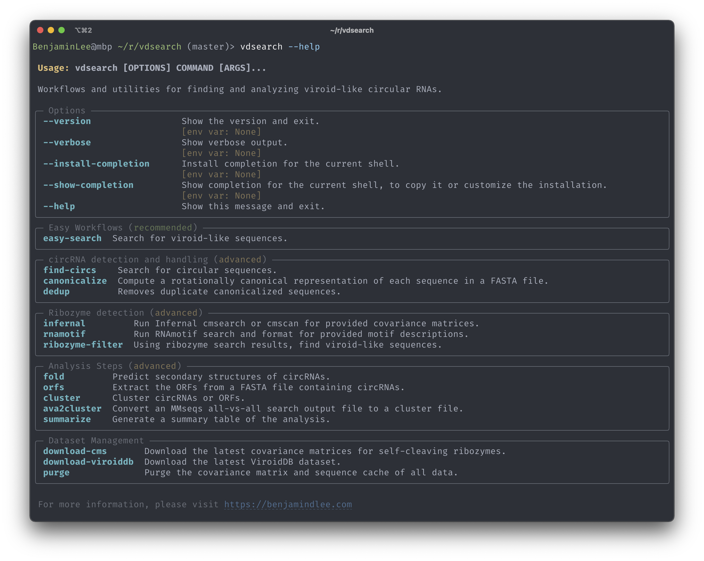

# vdsearch: find viroids and viroid-like circRNAs

Finding viroids used to be a difficult task. Now it can be done in one line of code:

```sh
vdsearch easy-search my-transcriptome.fasta
```

## Features

- End-to-end viroid-like RNA detection with one command
- Finds viroids (both families), satellite RNAs, ribozyviruses, and more
- _De novo_ and reference-free
- Works for both transcriptomes and metatranscriptomes

## Screenshots



## Example usage

- Find viroid-like cccRNAs in a transcriptome or metatranscriptome

  ```sh
  vdsearch easy-search my-transcriptome.fasta
  ```

- Detect circularity from assembled contigs

  ```sh
  vdsearch find-circs my-transcriptome.fasta
  ```

- Cluster circRNAs
  ```sh
  vdsearch cluster --preset nt-cluster circRNAs.fasta
  ```

## Installation

Installation is still a work in progress since the code is still in beta.
If you want to use it, please clone the repository and run the following commands:

```bash
git clone https://github.com/Benjamin-Lee/vdsearch.git
cd vdsearch

# activate a virtual environment (optional)
python3 -m venv venv
source venv/bin/activate

# install dependencies
pip install nimporter
pip install -e .

# test the installation
vdsearch --help
```

## Contributing

Contributions are always welcome!

See `contributing.md` for ways to get started.

## Support

For support, email [benjamin.lee@chch.ox.ac.uk](mailto:benjamin.lee@chch.ox.ac.uk) or [join our Slack channel](https://viroids.org/community).

## License

[MIT](https://choosealicense.com/licenses/mit/)

## Citation
Lee, B. D., Neri, U., Roux, S., Wolf, Y. I., Camargo, A. P., Krupovic, M., RNA Virus Discovery Consortium, Simmonds, P., Kyrpides, N., Gophna, U., Dolja, V. V., & Koonin, E. V. (2023). Mining metatranscriptomes reveals a vast world of viroid-like circular RNAs. Cell, 186(3), 646–661.e4. https://doi.org/10.1016/j.cell.2022.12.039

